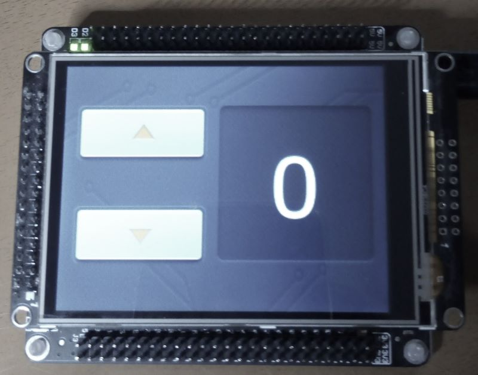
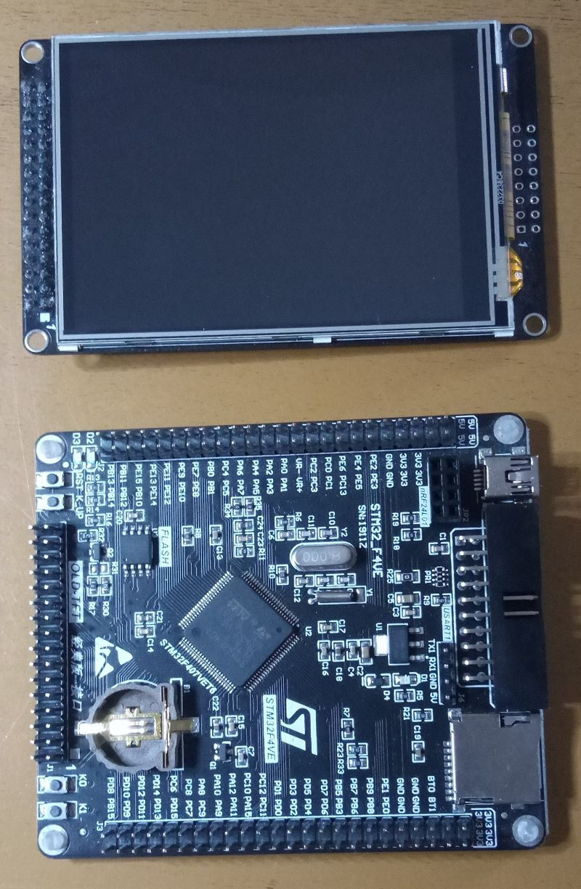
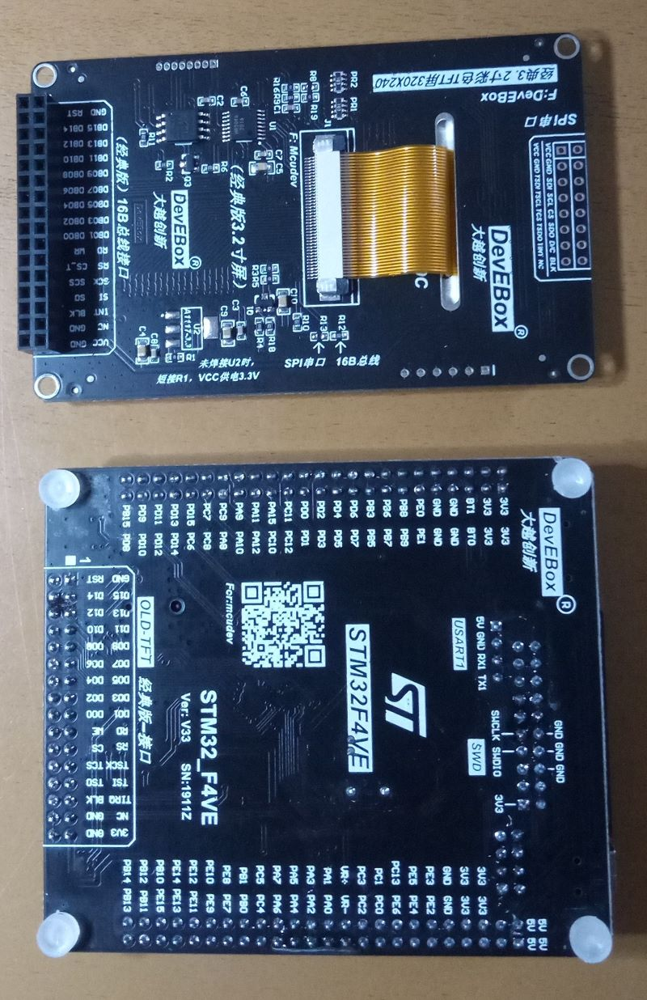
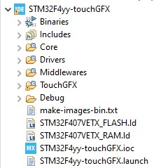

## TouchGFX on a no-name development board

I used the main controller STM32407vet6, connected with a display controller ili9341 and an external memory W25Q16. It's running without RTOS.
The Ilitek ili9341 is connected to 16 bit parallel with FSMC (flexible 
static memory controller).
The Winbond W25Q16 is connected to spi1.

picture 1: screen

picture 2: front side

picture 3: back side

### You need additional 3 apps and a programmer device

- STM32CubeIDE
- STM32CubeProgrammer
- TouchGFX Designer (with environment) 
- ST-Link (clones no longer work with ST)

### There are two relevant Repositories
1. this repository with code for creating your own ToughGFX application 
2. other repository "W25Q16-STM32F407" on my dashboard for making your own external loader (.stldr)

### Working flowchart
* configure your board in STM32CubeIDE
* * use FSMC for display, SPI for external memory and a timer for generator
* * select in Software Packs "X-Cube-TouchGFX"
* add driver for display controller, touch controller and external memory
* make modifications in code (marked with "harebit" -> search "harebit")
* * notably the generator in tim.c (115), which started ever again "touchgfxSignalVSync"
* create the TouchGFX example as described in "Tutorial 2: Creating Your Own Application" in TouchGFX Documentation
* compile all and transmit the code to main controller
* extract the images from xxx.elf in ToughGFX environment see make-images-bin.txt
* copy the external loader from the other repository drystone to sub folder "\bin\ExternalLoader" of STM32CubeProgrammer
* start STM32CubeProgrammer, select yyy.stldr as external loader, load the file path to the images.bin, erase all and download to address 0x90000000.

### Folders and Files
the complete project folder looks like this

I added in the repository only the relevant folder, the others are only generated by CubeIDE or TouchGFX and there is nothing to do. Except in Debug you will find images.bin and xxx.elf.

### Additional info

* https://support.touchgfx.com/docs/introduction/welcome
* https://helentronica.com/2021/01/22/touchgfx-on-a-custom-made-low-cost-board-with-the-ili9341-controller-over-spi/

 

